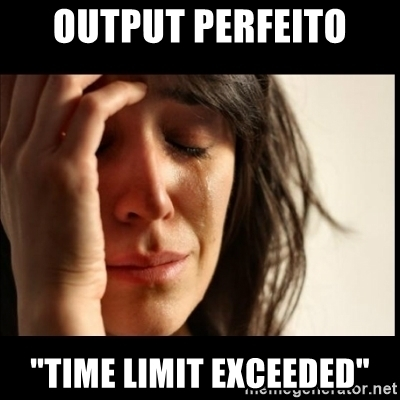

# Respostas URI
## Meus Algortimos mais estilosos

Essas são as minhas respostas às questões do [URI](https://www.urionlinejudge.com.br/judge/pt), quem sabe um dia eu não entro pro rank dos melhores computêros do site? Enquanto esse dia não chegar vocês vão ver muitos programas com "Time Limit Exceeded". 
#

# Quanto aos arquivos

Os arquivos contém os nomes das questões e sua identificação numérica, seguindo o formato: "nome da questão - 0000.py". Vocês podem encontrar a questão apenas digitando seu código no buscador do URI e voilà. Alguns, entretanto, não seguem esse modelo por que foram feitos antes de o modelo ser adotado, são os arquivos "a.py", "1.py" etc.
#
Lembrando que, caso o programa não funcione como deveria, vai ter um comentário avisando, logo no começo. Eu nem sei pra quê fico explicando essas coisas, esse repositório nem é tão relevante assim pra ter um README. Mas se você chegou aqui, acompanhe a minha jornada no URI, vai ver eu já sou um dos melhores no Rank! [Clica aqui vai](https://www.urionlinejudge.com.br/judge/pt/profile/463324)
